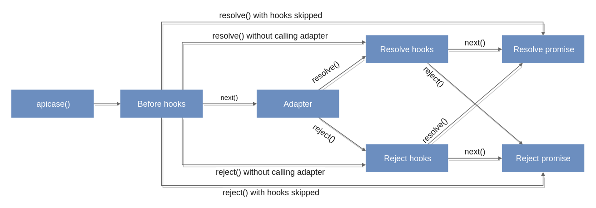

# Quick start

**Before start:** for better understanding, I will talk about only http APIs using fetch adapter.

Just keep in mind that:

```js
import { apicase } from "@apicase/core"
import fetch from "@apicase/adapter-fetch"

const doRequest = apicase(fetch)
```

Here I will show you core features of Apicase based on _"Create post"_ example.

## Events handling

Events allow you handle requests locally or globally via subscriptions.

Also, Apicase follows _"business logic failures are not exception"_ principle

So we need at least 3 states for that:

```javascript
/* Do you recognize axios? */
const payload = {
  url: "/api/posts",
  method: "POST",
  body: {
    title: "Hello, Apicase",
    text: "This is my favourite post"
  }
}

const request = doRequest(payload)

/* Request is done */
request.on("done", postSubmitted)
request.onDone(postSubmitted)

/* Request is failed but it's OK */
request.on("fail", invalidData)
request.onFail(invalidData)

/* Unexpected error (may be code error or smth else) */
request.on("error", logError)

/* Bonus #4: cancel event */
request.on("cancel", undoSubmit)
```

You still can use it as Promise or with `async/await`:

```javascript
const { success, result } = await doRequest(payload)
if (success) {
  /* resolved */
} else {
  /* rejected */
}
```

> – Looks easy  
> – But we haven't authentification  
> – Just scroll down :\)

## Middlewares

Middlewares allow you to change-on-fly/resolve/reject/retry API requests

Apicase creates an async queue that consists of _before_ hooks, _request_, _resolve_ and _reject_ hooks.

Look at this diagram:



Hook is an asynchronous function that accepts _payload_ and some callbacks.

* Use `next` to go to the next step \(or next hook\)
* Use `done` to call done hooks and resolve request
* Use `fail` to call fail hooks and reject request
* Use `retry` to start call again with another payload

Hooks are passed in `hooks` property

### Why is it important?

Still suffer with authentification? Just look at this:

```javascript
const call = doRequest({
  url: '/api/posts',
  method: 'POST',
  body: {
    title: 'Hello, Apicase',
    text: 'This is my favourite post'
  },
  hooks: {
    /* Add client token */
    before ({ payload, next }) {
      const token = localStorage.getItem('token')
      payload.headers = { 
        ...payload.headers, 
        token
      }
      next(payload)
    },
    /* If it's failed, try to refresh token */
    fail ({ payload, result, retry, next }) {
      if (result.status !== 401) return next(result)
      const { success } = await refreshToken.doRequest()
      if (success) {
        retry(payload)
      } else {
        next(result)
      }
    }
  }
})

/* Just listen to it */
call.on('done', postPublished)
call.on('fail', shitHappened)
```

> – Easy-easy!  
> – Should I write this on each call?? And... wait, what is `refreshToken`?  
> – You'll find out it soon :)

## Services

Apicase services provides an opportunity to split up your API logic onto services with unlimited inheritance.

You can partially put payload, hooks and all of request params to service and then call it.

You can extend services as much as you want.

Services also have global events listeners that allows you to do some cool things.

### Example of services usage

Let's move our refresh-token logic into a separated file \(e.g. _api.js_\):

```javascript
import fetch from '@apicase/adapter-fetch'
import { ApiService } from '@apicase/services'

/* Base options for all services */
export const BaseService = new ApiService({
  adapter: fetch,
  url: '/api'
}).on('error', globalErrorLogger)

/* Yep, it's here */
export const ReloginService = BaseService.extend({
  url: 'auth/refresh',
  hooks: {
    before ({ payload, next }) {
      const refreshToken = localStorage.getItem('refresh_token')
      payload.headers = { 
        ...payload.headers, 
        refreshToken
      }
      next(payload)
    }
  }
})

ReloginService.on('done', res => {
  localStorage.setItem('token', res.body.token)
})

/* API services with auth logic */
export const WithAuthService = BaseService.extend({
  hooks: {
    /* Add client token */
    before ({ payload, next }) {
      const token = localStorage.getItem('token')
      payload.headers = { 
        ...payload.headers, 
        token
      }
      next(payload)
    },
    /* If it's failed, try to refresh token */
    fail ({ payload, result, retry, next }) {
      if (result.status !== 401) return next(result)
      const { success } = await ReloginService.doRequest()
      if (success) {
        retry(payload)
      } else {
        next(result)
      }
    }
  }
})
```

And then, our API request now looks like in the first code example:

```javascript
import { WithAuthService } from "./api"

WithAuthService.doRequest({
  url: "posts",
  method: "POST",
  body: {
    title: "Hello, Apicase",
    text: "This is my favourite post"
  }
})
```

### Meta information

Also, you can pass `meta` property to request. It will be available in **hooks** only \(not in adapter\).

You can use it to check whether request should use auth logic or not:

```javascript
ApiService.doRequest({
  url: "posts",
  method: "POST",
  meta: { authReqired: true },
  body: {
    title: "Hello, Apicase",
    text: "This is my favourite post"
  }
})

/* or even better */
const WithAuthService = ApiService.extend({
  meta: { authRequired: true }
})

WithAuthService.doRequest(/* ... */)
```

### It's not all surprises

Now, let's imagine that we have **2 requests** running **at the same time**.

And **both** of them are **failed** because of outdated token.

What's now? Both of them will call `refreshToken` service?

No. Apicase solves that problem for you.

Services contain `queue` with all requests that are currently running.

And it has some methods to deal with it:

* **doRequest** - just do request. It will push it to queue and remove on finish
* **pushRequest** - do request after queue is finished
* **doSingleRequest** - do request only if there are no currently running requests. Otherwise, it will return currently running request that you can subscribe to
* **doUniqueRequest** - do request only if there are no currently running request with the same payload. Otherwise, it will return this request that you can subscribe to

So, to solve the problem, you can just replace `doRequest` to `doSingleRequest`. That's all you need to be happy :\)

## Adapters 

### What does it mean?

Apicase core doesn't know the ways to work with API. Instead, it just uses adapters.

It makes Apicase much more flexible, because It's not limited by http-only requests.

It also makes Apicase totally isomorphic because it's just a JS library that accepts any API and works with it.

### How adapter looks?

Adapter is an object with the following structure:

```javascript
const adapter = {
  /* Initial response state */
  createState: () => /* ... */,

  /* Callback that accepts payload and resolve/reject methods */
  callback ({ payload, resolve, reject }) { /* ... */ },

  /* Method that prepares payload for callback */
  convert: payload => /* ... */,

  /* Merge strategy for adapters payload (used in services */
  merge: (from, to) => /* ... */
}
```

This object just should be passed to `apicase` or `ApiService`:

```javascript
/* Just request */
apicase(adapter)(opts)

/* Service */
new ApiService({ adapter, ...opts })
```

As you can see at the start we used `@apicase/adapter-fetch`

### What adapters we have for now?

For now, apicase has only `fetch` and `xhr` official adapters.

But we are planning to add `websocket` support too and maybe some another cool things.
